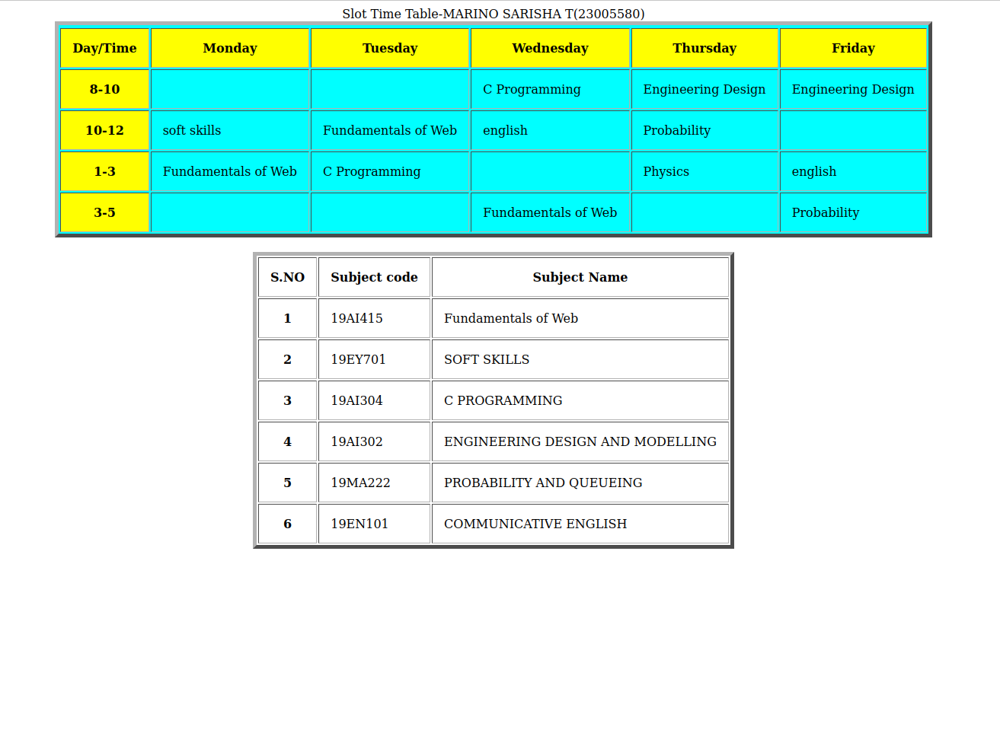

# Experiment_Time_Table

## AIM
To Write a html webpage page to display your timetable.

# ALGORITHM
### STEP 1
create a simple table using table tag
### STEP 2
Add header row using th tag
### STEP 3
Add your timetable
### STEP 4
Execute the program

# CODE
```
<html>
     <title>Time Table</title>
     <body>
     <center>
           <table border="5" bgcolor="cyan" cell spacing="10" cellpadding="15">
          
           <caption>Slot Time Table-MARINO SARISHA T(23005580)</caption>
           
<tr>
    <TR bgcolor="Yellow">
    <th>Day/Time</th>
    <th>Monday</th>
    <th>Tuesday</th>
    <th>Wednesday</th>
    <th>Thursday</th>
    <th>Friday</th>
    </TR>
</tr>
<tr>
   <th bgcolor="yellow">8-10</th>
   <td></td>
   <td></td>
   <td>C Programming</td>
   <td>Engineering Design</td>
   <td>Engineering Design</td>
</tr>
<tr>
   <th bgcolor="yellow">10-12</th>
   <td>soft skills</td>
   <td>Fundamentals of Web</td>
   <td>english</td>
   <td>Probability</td>
   <td></td>
</tr>
<tr>
    <th bgcolor="yellow">1-3</th>
   <td>Fundamentals of Web</td>
   <td>C Programming</td>
   <td></td>
   <td>Physics</td>
   <td>english</td>
</tr>
<tr>
   <th bgcolor="yellow">3-5</th>
   <td></td>
   <td></td>
   <td>Fundamentals of Web</td>
   <td></td>
   <td>Probability</td>
</tr>
</table>
<br>
<table>
 <table border="5" cell spacing="10" cellpadding="15">
<tr>
   <th>S.NO</th>
   <th>Subject code</th>
   <th>Subject Name</th>
</tr>
<tr>
   <th>1</th>
   <td>19AI415</td>
   <td>Fundamentals of Web</td>
</tr>
<tr>
   <th>2</th>
   <td>19EY701</td>
   <td>SOFT SKILLS</td>
</tr>
<tr>
   <th>3</th>
   <td>19AI304</td>
   <td>C PROGRAMMING</td>
</tr>
<tr>
   <th>4</th>
   <td>19AI302</td>
   <td>ENGINEERING DESIGN AND MODELLING</td>
</tr>
<tr>
   <th>5</th>
   <td>19MA222</td>
   <td>PROBABILITY AND QUEUEING</td>
</tr>
<tr>
    <th>6</th>
    <td>19EN101</td>
    <td>COMMUNICATIVE ENGLISH</td>
</tr>
</table>
</body>
</center>
</html>
```
# OUPUT



# RESULT
Thus the program excecuted successfully